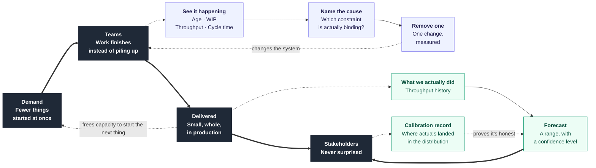
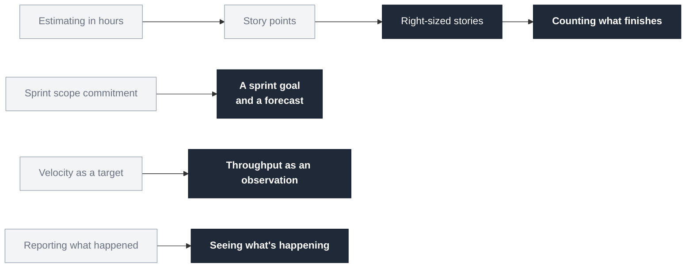

# Delivery, on one page

> **Predictability isn't a promise you make. It's a property of a system — one you can
> measure, and change.**

---

## The system

**Three loops, and that's the whole idea.**

| Loop | What it does | Why it was missing |
|---|---|---|
| **Improvement** | See → diagnose → remove a constraint → the system changes | Previous practices described the system. None fed back into it |
| **Forecast** | What we did → a range → what happened → proof it was honest | Forecasts were made, but never scored, so trust stayed an opinion |
| **Demand** | Finishing frees capacity to start the next thing | Nothing limited what could be started, so everything was |

---

## What this makes possible

Six things you couldn't do before.

| | Before | Now |
|---|---|---|
| **1** | You found out at the end of the sprint | **You see trouble while you can still act on it** |
| **2** | Theories about why delivery is slow | **You know which constraint is actually binding** |
| **3** | "It feels better" | **You can tell whether a change worked** |
| **4** | Everything started, everything late | **Start fewer things, and the first one lands in a third of the time** |
| **5** | Layers that prove nothing until they meet | **Something whole and usable, every few days** |
| **6** | "Trust us" | **Evidence the forecast is honest** |

---

## What we stopped doing

Not everything here is an addition. Some of it is removal.

---

## The one number

Everything else is diagnosis. This is the score:

> ### The gap between your 50th and 95th percentile cycle time.
>
> Narrowing = becoming predictable. Not moving = you've built reporting, not change.

Not throughput. Not velocity. Not how many sprints hit their scope. **The spread.**
Predictability is a narrow distribution, and nothing else.

---

## What it costs

**Three hours a week**, across three teams.

| | |
|---|---|
| 30 min | Refresh the charts |
| 90 min | One 30-minute flow review per team |
| **60 min** | **Removing the constraint you found** |
| 20 min | Notes |

The hour in bold is the one that changes anything. The rest only makes problems visible.

---

## How it could fail

Named in advance, so they're recognisable when they happen.

1. **All three teams at once** — no way to tell what worked
2. **No baseline** — no way to settle whether it improved
3. **The constraint hour gets dropped** — excellent reporting, unchanged system *(most likely)*
4. **A chart gets used to question a person** — the data stops being honest, and doesn't recover

---

*Full model: [`README.md`](README.md) · Start at [`docs/00-start-here.md`](docs/00-start-here.md)*
