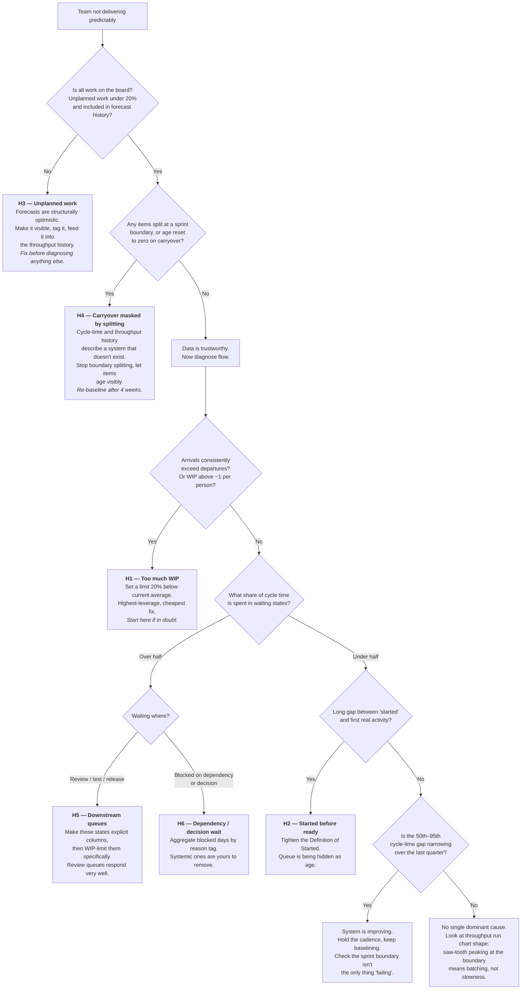
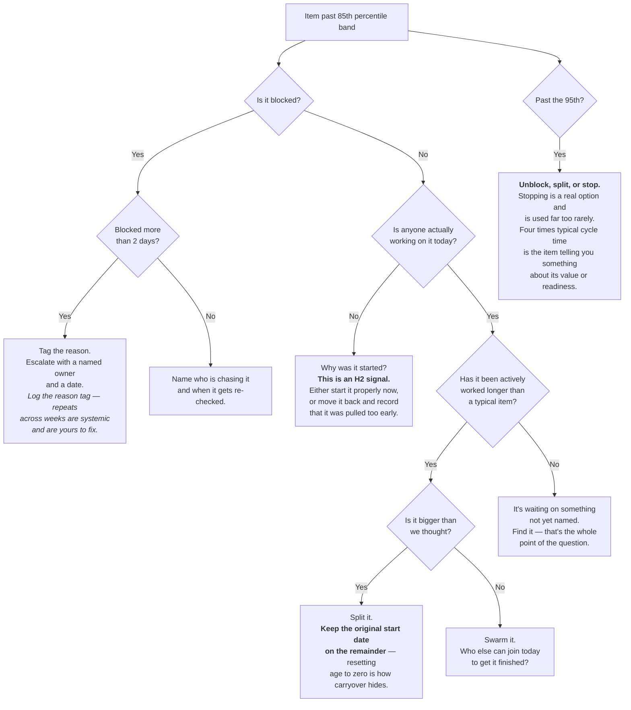

# 08 — Diagnostic decision tree

Two decision aids: one for diagnosing a **team**, one for triaging an **aged item** in
the weekly review.

Use them as routing, not as a script. Their job is to stop you defaulting to whichever
cause you found last time, and to make sure you check things in an order where the
answers can be trusted. If the tree points somewhere your judgement says is wrong,
follow your judgement — then work out which question the tree is missing.

---

## Tree 1 — Diagnosing a team

**Check data integrity first.** Hypotheses H3 and H4 corrupt the very measures you'd use
to test H1, H2, H5 and H6. Diagnosing WIP from a throughput history polluted by
boundary-splitting wastes a month and produces a confident wrong answer.

### The question the tree can't ask

If you reach the bottom with nothing conclusive, ask this one by hand:

> **Are the Monte Carlo forecasts roughly accurate while sprints routinely carry over?**

If yes, the teams are predictable and only the boundary is failing. No amount of flow
work will fix that, because nothing is broken — the scoreboard is measuring the wrong
unit. That's `docs/01-diagnosis.md`, "the sprint-boundary contradiction", and the fix is
a conversation, not an intervention.

---

## Tree 2 — Triaging an aged item in the weekly review

For each item past the 85th percentile band, oldest first. Every item leaves the meeting
with a named next action and an owner.

### The one question

Every branch above is a way of answering a single question, asked of the **item** and
never of the person:

> **What is stopping this finishing today?**

Not "how's it going". "How's it going" gets you a status update and a feeling. The
question above gets you an obstacle with a name, which is the only thing you can
actually act on.
